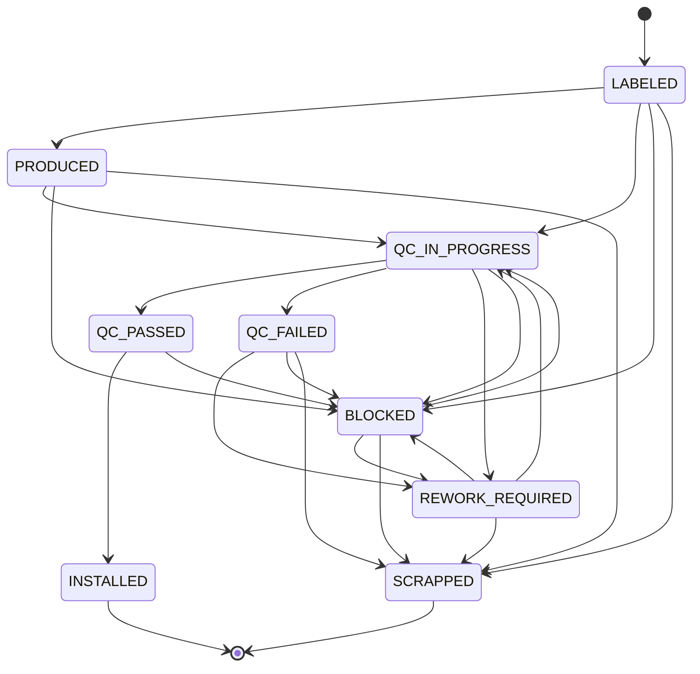
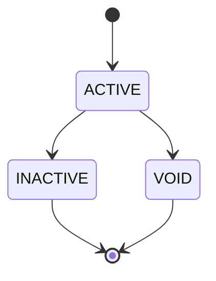

# Production Item Lifecycle

This diagram reflects the production item state machine currently implemented in the backend rules.

## Related barcode lifecycle

The production item lifecycle is complemented by a separate barcode status lifecycle:

## Practical meaning

- `QC_PASSED` is the state that allows installation into a device
- `QC_FAILED`, `REWORK_REQUIRED`, and `SCRAPPED` block normal downstream flow
- `BLOCKED` is a catch-all stop state that can later re-enter controlled rework or QC
- barcode state and production-item state are related, but they are not the same thing
