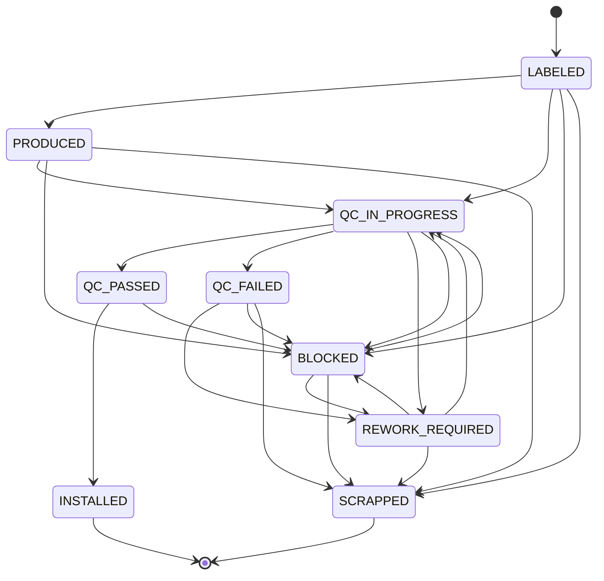
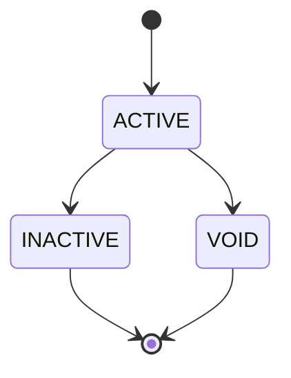

# Lifecycle production itemu

Ten diagram odzwierciedla maszynę stanów `ProductionItem`, która jest obecnie zaimplementowana w regułach backendu.

## Powiązany lifecycle barcode

Lifecycle production itemu jest uzupełniony o osobny lifecycle statusu barcode:

## Znaczenie praktyczne

- `QC_PASSED` jest stanem, który pozwala na montaż do urządzenia
- `QC_FAILED`, `REWORK_REQUIRED` i `SCRAPPED` blokują normalny dalszy flow
- `BLOCKED` jest ogólnym stanem stop, z którego item może później wrócić do kontrolowanego reworku albo QC
- status barcode i status production itemu są ze sobą powiązane, ale nie są tym samym
