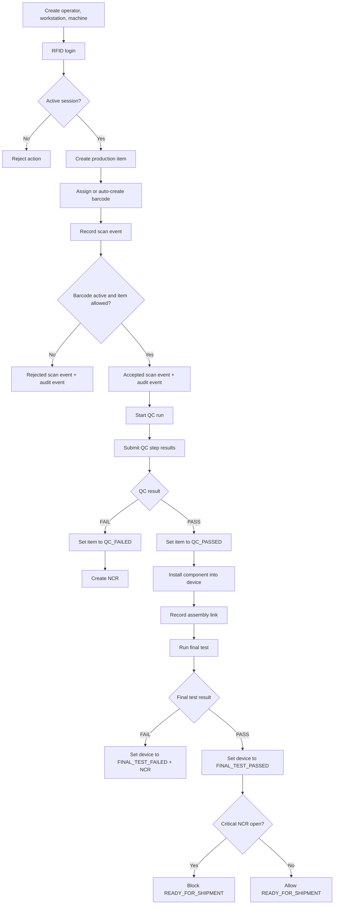

# Production Traceability Flow

This diagram focuses on the currently implemented backbone of the production workflow.

## What is important in this flow

- almost every meaningful production action depends on an active `work_session_id`
- scan events and audit events are both part of the traceability record
- QC and final test are the current main gatekeepers for downstream progression
- shipment is not a free status change; it is constrained by test and NCR state
