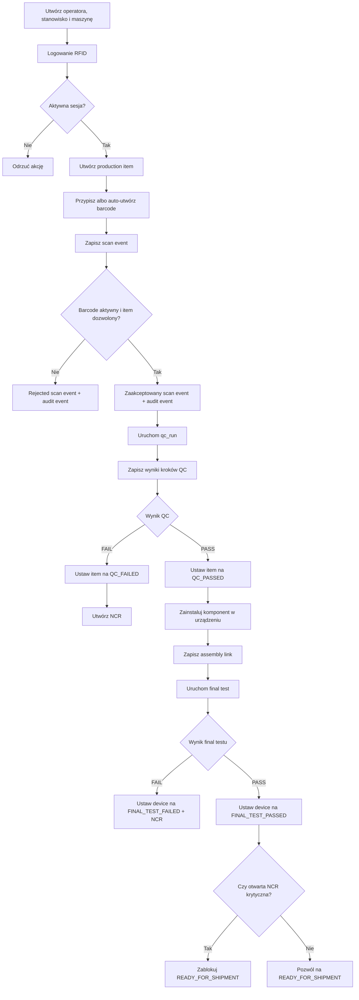

# Przepływ traceability w produkcji

Ten diagram skupia się na aktualnie zaimplementowanym szkielecie przepływu produkcyjnego.

## Co jest ważne w tym flow

- prawie każda istotna akcja produkcyjna zależy od aktywnego `work_session_id`
- scan eventy i audit eventy są równoległą częścią śladu traceability
- QC i final test są dziś głównymi bramkami dla dalszego przejścia procesu
- shipment nie jest swobodną zmianą statusu; zależy od testu i stanu NCR
