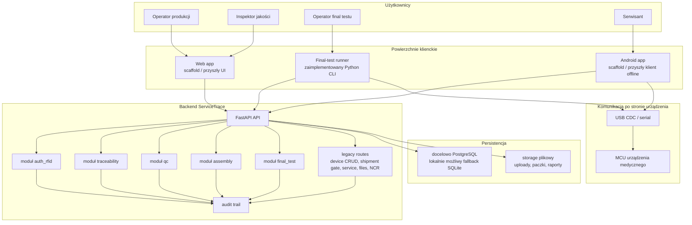

# Architektura systemu

Ten diagram pokazuje aktualny kształt systemu w repozytorium.

- backend jest dziś zaimplementowanym centrum ciężkości
- final-test-runner jest już realnie połączony z backendem
- web i Android pozostają na poziomie scaffoldów

## Jak czytać ten diagram

- backend jest dziś operacyjnym rdzeniem produktu
- `auth_rfid`, `traceability`, `qc`, `assembly` i `final_test` są już aktywnymi modułami backendu
- device CRUD, shipment gate, uploady serwisowe, pliki i NCR nadal częściowo zależą od legacy route code
- final-test-runner jest najbardziej realnym klientem poza backendem
- mobile i web są widoczne w repo, ale nie są jeszcze pełnymi aplikacjami produktowymi
