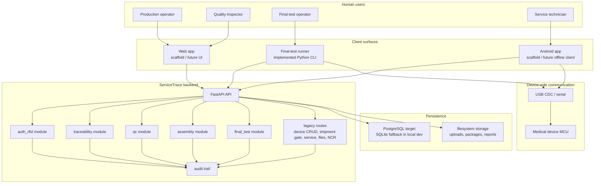

# System Architecture

This diagram shows the current system shape of the repository.

- the backend is the implemented center of gravity
- the final-test runner is already connected to the backend
- web and Android remain scaffold-level surfaces

## Interpretation

- today, the backend is the operational core of the product
- `auth_rfid`, `traceability`, `qc`, `assembly`, and `final_test` are already active backend modules
- device CRUD, shipment gate, service uploads, files, and NCR still partly depend on legacy route code
- the final-test runner is the most real client outside the backend
- mobile and web are repo-visible, but not yet product-complete
