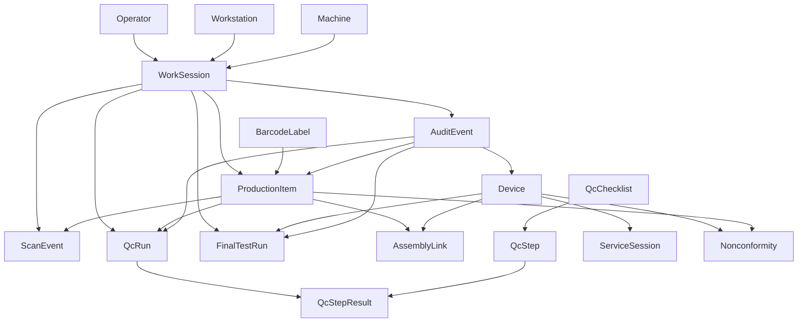

# Domain Model Guide

This document describes the current business domains, core entities, and main relationships in the ServiceTrace MVP.

It is intentionally grounded in what exists in the repository now, while also calling out areas that are still only partially moved into the new modular layout.

## Domain overview

ServiceTrace currently revolves around these domains:

- auth and RFID
- traceability
- QC and NCR
- assembly
- final test
- shipment gate
- service and commissioning
- files and audit trail

At the moment, some of these domains already have active module routers and services, while others still execute through legacy API routes.

## High-level domain flow

## Key business identifiers

The most important identifiers in the current model are:

- `operator_id`
  Human operator identity used in production, QC, and final test.
- `work_session_id`
  Active RFID-authenticated session that gives process context.
- `barcode_value`
  Unique code attached to a physical part instance.
- `item_serial_number`
  Unique serial of a production item or component instance.
- `device_serial_number`
  Unique serial of the final assembled device.
- `run_id`
  QC run identifier.
- `test_run_id`
  Final test identifier.
- `ncr_id`
  Nonconformity identifier.

These ids are more important for business traceability than internal UUID primary keys.

## Bounded contexts

### 1. Auth and RFID

Purpose:

- identify operators
- identify workstation context
- create and validate active work sessions

Core entities:

- `Operator`
- `Workstation`
- `Machine`
- `WorkSession`

Main rules:

- RFID login starts or reuses an active work session
- timed-out sessions are automatically invalidated
- operator role determines which actions are allowed
- downstream traceability actions depend on the active session context

Implementation status:

- implemented in the `auth_rfid` module

### 2. Traceability

Purpose:

- give every physical part instance a unique identity
- record scan history
- maintain status of production items

Core entities:

- `BarcodeLabel`
- `ProductionItem`
- `ScanEvent`
- `AuditEvent`

Main rules:

- barcode values must be unique
- production item serials must be unique
- inactive or voided barcodes cannot be scanned successfully
- blocked items and scrapped items must not pass normal scan flow
- accepted and rejected scans both leave a ledger trail

Implementation status:

- implemented in the `traceability` module

### 3. QC and NCR

Purpose:

- define checklists and steps
- execute QC against items or devices
- derive pass or fail outcomes
- open nonconformities on blocking failure

Core entities:

- `QcChecklist`
- `QcStep`
- `QcRun`
- `QcStepResult`
- `Nonconformity`

Main rules:

- QC requires an active work session with quality permissions
- a QC run targets either a device or a production item
- measurement-based steps can auto-fail when outside tolerance
- failed QC moves the target item to `QC_FAILED`
- failed QC can create a critical open NCR

Implementation status:

- checklist and QC run flow implemented in the `qc` module
- NCR CRUD still lives in legacy routes

### 4. Assembly

Purpose:

- build a device from concrete, scanned physical components
- keep a record of exactly which item instance was installed into which device

Core entities:

- `Device`
- `AssemblyLink`
- `ProductionItem`
- `ScanEvent`

Main rules:

- a component must exist before it can be installed
- a component with bad status cannot be installed
- a component cannot be installed twice while already active in another device
- assembly produces both component relation data and scan trail data

Implementation status:

- business flow exists
- route still lives in legacy API code
- `assembly` module is currently only a scaffold

### 5. Final test

Purpose:

- store workstation final test results for finished devices
- capture test result as a shipment-relevant business event

Core entities:

- `FinalTestRun`
- `Device`
- `Nonconformity`
- `AuditEvent`

Main rules:

- final test requires an active work session with final-test permissions
- PASS moves the device to `FINAL_TEST_PASSED`
- FAIL moves the device to `FINAL_TEST_FAILED`
- FAIL creates a critical NCR

Implementation status:

- business flow exists
- route still lives in legacy API code
- `final_test` module is currently only a scaffold

### 6. Shipment gate

Purpose:

- prevent a device from being marked ready for shipment if critical preconditions are not met

Core entities:

- `Device`
- `FinalTestRun`
- `Nonconformity`

Current implemented rule:

- `READY_FOR_SHIPMENT` requires device status `FINAL_TEST_PASSED`
- open critical NCR blocks shipment

Implementation status:

- minimal gate is implemented in legacy device status logic
- `shipment` module is currently only a scaffold

### 7. Service and commissioning

Purpose:

- receive uploaded service session packages
- attach service artifacts to a device history

Core entities:

- `ServiceSession`
- `StoredFile`

Current scope in code:

- upload and list service-session packages
- store package path and hash

Planned but not yet implemented as a full workflow:

- full offline commissioning mobile flow
- guided technician session lifecycle
- richer service event model

Implementation status:

- upload flow exists in legacy API code
- `service` module is currently only a scaffold

### 8. Files and audit trail

Purpose:

- attach files to business entities
- keep an append-like audit history of important actions

Core entities:

- `StoredFile`
- `AuditEvent`

Design role:

- `StoredFile` is a generic attachment table keyed by entity type and entity id
- `AuditEvent` is the cross-domain accountability ledger

Implementation status:

- file upload and download exist in legacy API code
- audit listing exists in the `traceability` module
- `files` module is currently only a scaffold

## Entity-by-entity map

### `Operator`

Represents a named human actor with a role and optional RFID hash.

Key fields:

- `operator_id`
- `full_name`
- `role`
- `rfid_uid_hash`
- `is_active`

### `Workstation`

Represents the physical or logical station where work is performed.

Key fields:

- `workstation_id`
- `name`
- `area`
- `station_type`
- `is_active`

### `Machine`

Represents a machine that can be associated with a work session or item creation context.

Key fields:

- `machine_id`
- `name`
- `machine_type`
- `location`
- `is_active`

### `WorkSession`

Represents the authenticated operating context used to authorize downstream workflow actions.

Key fields:

- `work_session_id`
- `operator_id`
- `workstation_id`
- `machine_id`
- `status`
- `started_at`
- `ended_at`

Typical statuses:

- `ACTIVE`
- `CLOSED`
- `TIMEOUT`

### `BarcodeLabel`

Represents the unique code attached to a physical instance.

Key fields:

- `barcode_value`
- `entity_type`
- `entity_serial_number`
- `label_type`
- `status`

Typical statuses:

- `ACTIVE`
- `INACTIVE`
- `VOID`

### `ProductionItem`

Represents a concrete physical part or component instance in the production flow.

Key fields:

- `item_serial_number`
- `barcode_value`
- `item_type`
- `part_number`
- `revision`
- `machine_id`
- `created_by_operator_id`
- `current_status`

Typical statuses currently used:

- `LABELED`
- `PRODUCED`
- `QC_IN_PROGRESS`
- `QC_PASSED`
- `QC_FAILED`
- `REWORK_REQUIRED`
- `BLOCKED`
- `INSTALLED`
- `SCRAPPED`

### `ScanEvent`

Represents one scan ledger event for a barcode.

Key fields:

- `scan_event_id`
- `barcode_value`
- `operator_id`
- `workstation_id`
- `context`
- `result`
- `message`

The current design uses scan events as an operational history log rather than as the sole source of truth for all item state.

### `QcChecklist`

Represents a versioned QC template for a given process stage.

Key fields:

- `checklist_code`
- `name`
- `process_stage`
- `version`
- `is_active`

### `QcStep`

Represents a single step within a checklist.

Key fields:

- `checklist_id`
- `step_order`
- `title`
- `requires_photo`
- `requires_measurement`
- `blocking_on_fail`
- `tolerance_min`
- `tolerance_max`

### `QcRun`

Represents one execution of a QC process.

Key fields:

- `run_id`
- `device_serial_number`
- `item_serial_number`
- `barcode_value`
- `checklist_id`
- `process_stage`
- `operator_id`
- `status`
- `result`

Important note:

- the field name `device_serial_number` is currently also used as a general target serial slot in some QC flows, even when the run is about a production item

### `QcStepResult`

Represents the result of one QC step within a run.

Key fields:

- `qc_run_id`
- `step_id`
- `status`
- `measurement_value`
- `comment`
- `mcu_snapshot`

### `Device`

Represents the assembled medical device as the top-level production object.

Key fields:

- `device_serial_number`
- `device_type`
- `hardware_version`
- `firmware_version`
- `bootloader_version`
- `production_status`

Typical statuses currently seen:

- `CREATED`
- `FINAL_TEST_PASSED`
- `FINAL_TEST_FAILED`
- `READY_FOR_SHIPMENT`

### `AssemblyLink`

Represents one installed component relation inside a device tree.

Key fields:

- `parent_device_serial_number`
- `child_item_serial_number`
- `child_barcode_value`
- `component_type`
- `installed_by`
- `workstation_id`
- `scan_event_id`
- `status`

### `FinalTestRun`

Represents one final test execution for a device.

Key fields:

- `test_run_id`
- `device_serial_number`
- `operator_id`
- `result`
- `firmware_version`
- `bootloader_version`
- `report_path`
- `mcu_log_path`

Typical results:

- `PASS`
- `FAIL`
- `HOLD`

### `Nonconformity`

Represents a recorded quality issue that may block downstream flow.

Key fields:

- `ncr_id`
- `device_serial_number`
- `component_serial_number`
- `process_stage`
- `description`
- `severity`
- `status`
- `detected_by`

Typical values:

- severity: `MEDIUM`, `CRITICAL`
- status: `OPEN`, `CLOSED`

### `ServiceSession`

Represents a service or commissioning package uploaded for a device.

Key fields:

- `session_id`
- `device_serial_number`
- `technician_id`
- `result`
- `package_path`
- `package_hash`
- `upload_status`

### `StoredFile`

Represents a generic stored file attached to a business entity.

Key fields:

- `related_entity_type`
- `related_entity_id`
- `file_name`
- `file_path`
- `file_hash`

### `AuditEvent`

Represents a cross-domain audit record.

Key fields:

- `event_type`
- `entity_type`
- `entity_id`
- `work_session_id`
- `operator_id`
- `workstation_id`
- `machine_id`
- `result`
- `message`
- `payload`

## Important cross-domain invariants

- every accepted production action should be attributable to an operator and workstation context
- every physical production item should have one unique business identity
- every final device should be traceable to concrete component instances
- blocking QC or final-test failures should surface as downstream business constraints
- audit history should preserve who did what, where, and with what outcome

## Current implementation truth vs target architecture

Current reality:

- `auth_rfid`, `traceability`, and `qc` already contain active module logic
- assembly, final test, shipment, service, files, and NCR are still partly or mostly handled in legacy routes

Target direction:

- move each domain behind its own router, service, and repository boundary
- keep a single backend and database
- make domain transitions explicit and test-covered

## Recommended next domain-level cleanups

- move NCR logic into a dedicated domain module
- move assembly and final-test flows out of legacy routes
- clarify the QC target model so device-target and item-target semantics are explicit
- formalize status enums instead of relying on free-form strings
