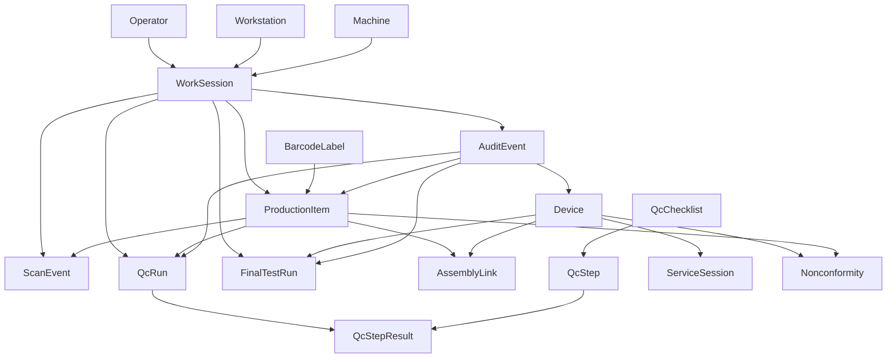

# Przewodnik po modelu domenowym

Ten dokument opisuje aktualne domeny biznesowe, główne encje i najważniejsze relacje w MVP ServiceTrace.

Opis jest świadomie oparty na tym, co naprawdę istnieje dziś w repo, ale wskazuje też obszary, które nadal są tylko częściowo przeniesione do nowego układu modułowego.

## Przegląd domen

ServiceTrace obraca się obecnie wokół następujących domen:

- auth i RFID
- traceability
- QC i NCR
- assembly
- final test
- shipment gate
- service i commissioning
- pliki oraz audit trail

Te domeny mają już aktywne routery i serwisy modułowe. Device CRUD i proste endpointy komponentów zostały włączone do modułu `assembly`.

## Wysokopoziomowy przepływ domenowy

## Kluczowe identyfikatory biznesowe

Najważniejsze identyfikatory w obecnym modelu to:

- `operator_id`
  Tożsamość operatora używana w produkcji, QC i final teście.
- `work_session_id`
  Aktywna sesja RFID nadająca kontekst procesowy.
- `barcode_value`
  Unikalny kod przypisany do fizycznego egzemplarza części.
- `item_serial_number`
  Unikalny numer seryjny production itemu albo komponentu.
- `device_serial_number`
  Unikalny numer seryjny gotowego urządzenia.
- `run_id`
  Identyfikator `qc_run`.
- `test_run_id`
  Identyfikator final testu.
- `ncr_id`
  Identyfikator niezgodności.

Te identyfikatory są ważniejsze dla traceability niż wewnętrzne UUID primary key.

## Konteksty ograniczone

### 1. Auth i RFID

Cel:

- identyfikacja operatorów
- identyfikacja kontekstu stanowiska
- tworzenie i walidacja aktywnych work sessions

Główne encje:

- `Operator`
- `Workstation`
- `Machine`
- `WorkSession`

Najważniejsze reguły:

- logowanie RFID uruchamia albo ponownie wykorzystuje aktywną work session
- przeterminowane sesje są automatycznie unieważniane
- rola operatora decyduje, które akcje są dozwolone
- dalsze akcje traceability zależą od aktywnego kontekstu sesji

Stan implementacji:

- zaimplementowane w module `auth_rfid`

### 2. Traceability

Cel:

- nadanie każdej fizycznej części unikalnej tożsamości
- zapis historii skanów
- utrzymanie statusu production itemów

Główne encje:

- `BarcodeLabel`
- `ProductionItem`
- `ScanEvent`
- `AuditEvent`

Najważniejsze reguły:

- wartości barcode muszą być unikalne
- numery seryjne production itemów muszą być unikalne
- nieaktywne albo unieważnione barcode nie mogą być poprawnie skanowane
- zablokowane albo zezłomowane itemy nie przechodzą normalnego flow skanowania
- zarówno zaakceptowane, jak i odrzucone skany zostawiają ślad w ledgerze

Stan implementacji:

- zaimplementowane w module `traceability`

### 3. QC i NCR

Cel:

- definiowanie checklist i kroków
- wykonywanie QC dla itemów albo urządzeń
- wyliczanie wyników pass/fail
- otwieranie NCR przy blokującej porażce

Główne encje:

- `QcChecklist`
- `QcStep`
- `QcRun`
- `QcStepResult`
- `Nonconformity`

Najważniejsze reguły:

- QC wymaga aktywnej work session z uprawnieniami jakościowymi
- `qc_run` celuje albo w device, albo w production item
- kroki pomiarowe mogą automatycznie zwracać `FAIL`, gdy wyjdą poza tolerancję
- nieudane QC przenosi target itemu do `QC_FAILED`
- nieudane QC może utworzyć krytyczną otwartą NCR

Stan implementacji:

- checklisty i flow `qc_run` są zaimplementowane w module `qc`
- CRUD NCR jest zaimplementowany w module `nonconformities`

### 4. Assembly

Cel:

- złożenie urządzenia z konkretnych, zeskanowanych fizycznych komponentów
- utrzymanie informacji, który dokładnie egzemplarz itemu został zainstalowany w którym urządzeniu

Główne encje:

- `Device`
- `DeviceBomTemplate`
- `DeviceBomItem`
- `AssemblyLink`
- `ProductionItem`
- `ScanEvent`

Najważniejsze reguły:

- komponent musi istnieć, zanim zostanie zainstalowany
- komponent ze złym statusem nie może być zamontowany
- typ zeskanowanego itemu musi zgadzać się z deklarowanym `component_type`
- jeśli aktywny BOM istnieje dla `device_type`, komponent musi być dozwolony przez ten BOM
- jeśli dla `device_type` istnieją już wersje BOM, ale żadna nie jest aktywna, nowy montaż urządzenia bez przypiętej wersji BOM jest blokowany
- jeśli pozycja BOM wymaga konkretnego `part_number`, zeskanowany item musi mieć dokładnie tę wartość
- jeśli pozycja BOM wymaga konkretnej `revision`, zeskanowany item musi mieć dokładnie tę rewizję
- jeśli pozycja BOM wymaga konkretnego `drawing_number`, zeskanowany item musi mieć dokładnie ten numer rysunku
- jeśli pozycja BOM wymaga konkretnej `drawing_revision`, zeskanowany item musi mieć dokładnie tę rewizję rysunku
- jeśli BOM ogranicza ilość danego komponentu, assembly blokuje przekroczenie limitu już na etapie skanu
- komponent nie może zostać zainstalowany drugi raz, jeśli jest już aktywny w innym urządzeniu
- assembly produkuje zarówno relację montażową, jak i ślad skanu
- definicje BOM dla `device_type` są utrzymywane w `DeviceBomTemplate` i `DeviceBomItem`
- definicje BOM są dziś scope’owane nie tylko per `device_type`, ale też per `variant_code`, z fallbackiem urządzeń do wariantu `DEFAULT`
- pozycja `DeviceBomItem` może dodatkowo zawęzić dopuszczalny `part_number` i `revision`
- pozycja `DeviceBomItem` może też zawęzić dopuszczalny `drawing_number` i `drawing_revision`
- pozycja `DeviceBomItem` może też należeć do `substitution_group`, która opisuje jeden logiczny slot akceptujący kilka alternatywnych typów komponentów
- wersja `DeviceBomTemplate` ma jawny status lifecycle: `ACTIVE`, `INACTIVE` albo `RETIRED`
- wersja `DeviceBomTemplate` ma też lineage przez `source_template_id` i `replaced_by_template_id`
- wersja `RETIRED` jest niemodyfikowalna i może być używana dalej tylko przez urządzenia już wcześniej przypięte do tej wersji
- nowa wersja `DeviceBomTemplate` może powstać przez klonowanie istniejącej wersji razem z kompletem pozycji BOM
- aktywna wersja `DeviceBomTemplate` może zostać promowana do nowej rewizji jako operacja biznesowa łącząca klonowanie, aktywację i wycofanie poprzedniej wersji
- wersje BOM używają numerycznego formatu rozdzielanego kropkami, a `target_version` w `clone` i `promote` musi być semantycznie większy od `source_version`
- aktywna wersja `DeviceBomTemplate`, która została już przypięta do urządzeń przez `AssemblyLink`, dostaje soft-lock i nie może być dalej rozszerzana o nowe pozycje
- stan użycia konkretnej wersji BOM jest dostępny przez dedykowany odczyt `usage`, który zwraca też rekomendowaną dalszą akcję dla operatora lub klienta API
- konkretne urządzenia związane z wersją BOM są dostępne przez odczyt `bindings`, co pozwala ocenić wpływ zmian na już rozpoczętą produkcję
- kompletność tych urządzeń względem BOM jest dostępna przez odczyt `coverage`, który pokazuje braki i status per komponent
- wersja BOM może mieć też jawne metadane release: `approved_by`, `approved_at` i `release_note`
- stan gotowości konkretnej wersji BOM jest dostępny przez odczyt `readiness`, który blokuje aktywację pustych albo wyłącznie opcjonalnych wersji
- porównanie dwóch wersji BOM jest dostępne przez odczyt `diff`, który rozbija zmiany na pozycje dodane, usunięte i zmodyfikowane
- shipment gate wymaga już nie tylko obecności komponentów wymaganych, ale też braku komponentów nieoczekiwanych i nadmiarowych względem BOM
- baza wymusza już unikalność `component_type` w obrębie jednego template BOM, co stabilizuje dalsze rozszerzenia modelu

Najbliższe punkty rozszerzenia BOM:
- dalsze scope’y ponad `variant_code`, np. `market_code`, `station_type` albo profil urządzenia
- okna obowiązywania `effective_from` i `effective_to` są już zaimplementowane dla wersji BOM; kolejnym krokiem może być rozszerzenie ich o zakres partii albo numer zlecenia
- grupy zamienników na poziomie `substitution_group` są już zaimplementowane dla alternatywnych `component_type`; kolejnym krokiem może być rozszerzenie tej logiki na bardziej złożone kombinacje `part_number`
- kontrola zatwierdzenia wersji, np. `approved_by`, `approved_at`, `release_note`, jeśli BOM ma wejść w formalny workflow release
- pozycje `DeviceBomItem` w wersjach roboczych mogą być już nie tylko dodawane, ale też aktualizowane i usuwane w ramach tej samej polityki mutowalności

Stan implementacji:

- zaimplementowane w module `assembly`
- moduł `assembly` obsługuje też device CRUD, proste endpointy komponentów i API do zarządzania BOM
- shipment dalej sprawdza końcową kompletność wymaganego BOM przed `READY_FOR_SHIPMENT`

### 5. Final test

Cel:

- zapis wyników final testu wykonanego na stanowisku
- zapisanie wyniku testu jako zdarzenia biznesowego wpływającego na shipment

Główne encje:

- `FinalTestRun`
- `Device`
- `Nonconformity`
- `AuditEvent`

Najważniejsze reguły:

- final test wymaga aktywnej work session z rolą final-testową
- `PASS` przenosi urządzenie do `FINAL_TEST_PASSED`
- `FAIL` przenosi urządzenie do `FINAL_TEST_FAILED`
- `FAIL` tworzy krytyczną NCR

Stan implementacji:

- zaimplementowane w module `final_test`
- przejścia statusów shipment są zaimplementowane w module `shipment`

### 6. Shipment gate

Cel:

- zablokowanie ustawienia urządzenia jako gotowego do wysyłki, jeśli krytyczne warunki nie są spełnione

Główne encje:

- `Device`
- `FinalTestRun`
- `Nonconformity`

Aktualnie zaimplementowana reguła:

- `READY_FOR_SHIPMENT` wymaga statusu `FINAL_TEST_PASSED`
- wymagane komponenty są odczytywane z aktywnego BOM w tabelach `device_bom_templates` i `device_bom_items`
- brakujący komponent jest raportowany w błędzie wraz z ilością, jeśli `quantity_required > 1`
- otwarta krytyczna NCR blokuje shipment
- jeśli urządzenie nie jest jeszcze przypięte do BOM, a dla jego `device_type` nie ma aktywnej wersji, shipment jest blokowany

Stan implementacji:

- minimalna bramka z BOM utrzymywanym w bazie per `device_type` jest zaimplementowana w module `shipment`

### 7. Service i commissioning

Cel:

- przyjmowanie paczek z sesji serwisowych
- podpinanie artefaktów serwisowych do historii urządzenia

Główne encje:

- `ServiceSession`
- `StoredFile`

Aktualny zakres w kodzie:

- upload i listing paczek sesji serwisowych
- zapis ścieżki i hasha paczki

Planowane, ale jeszcze niezaimplementowane jako pełny przepływ:

- pełny mobilny commissioning offline
- prowadzenie technika przez sesję krok po kroku
- bogatszy model zdarzeń serwisowych

Stan implementacji:

- flow uploadu istnieje w module `service`

### 8. Pliki i audit trail

Cel:

- podpinanie plików do encji biznesowych
- utrzymywanie append-like historii ważnych działań

Główne encje:

- `StoredFile`
- `AuditEvent`

Rola w projekcie:

- `StoredFile` jest generyczną tabelą załączników powiązaną przez typ i id encji
- `AuditEvent` jest cross-domenowym ledgerem odpowiedzialności

Stan implementacji:

- upload i download plików istnieją w module `files`
- listing audit eventów istnieje w module `traceability`

## Mapa encji

### `Operator`

Nazwany aktor ludzki z rolą i opcjonalnym hashem RFID.

Kluczowe pola:

- `operator_id`
- `full_name`
- `role`
- `rfid_uid_hash`
- `is_active`

### `Workstation`

Fizyczne albo logiczne stanowisko, na którym wykonywana jest praca.

Kluczowe pola:

- `workstation_id`
- `name`
- `area`
- `station_type`
- `is_active`

### `Machine`

Maszyna, która może być powiązana z work session albo z kontekstem wytworzenia itemu.

Kluczowe pola:

- `machine_id`
- `name`
- `machine_type`
- `location`
- `is_active`

### `WorkSession`

Uwierzytelniony kontekst pracy używany do autoryzacji dalszych akcji przepływu.

Kluczowe pola:

- `work_session_id`
- `operator_id`
- `workstation_id`
- `machine_id`
- `status`
- `started_at`
- `ended_at`

Typowe statusy:

- `ACTIVE`
- `CLOSED`
- `TIMEOUT`

### `BarcodeLabel`

Unikalny kod przypisany do fizycznego egzemplarza.

Kluczowe pola:

- `barcode_value`
- `entity_type`
- `entity_serial_number`
- `label_type`
- `status`

Typowe statusy:

- `ACTIVE`
- `INACTIVE`
- `VOID`

### `ProductionItem`

Konkretny fizyczny egzemplarz części albo komponentu w procesie produkcyjnym.

Kluczowe pola:

- `item_serial_number`
- `barcode_value`
- `item_type`
- `part_number`
- `revision`
- `machine_id`
- `created_by_operator_id`
- `current_status`

Typowe aktualnie używane statusy:

- `LABELED`
- `PRODUCED`
- `QC_IN_PROGRESS`
- `QC_PASSED`
- `QC_FAILED`
- `REWORK_REQUIRED`
- `BLOCKED`
- `INSTALLED`
- `SCRAPPED`

### `ScanEvent`

Pojedyncze zdarzenie skanu dla barcode.

Kluczowe pola:

- `scan_event_id`
- `barcode_value`
- `operator_id`
- `workstation_id`
- `context`
- `result`
- `message`

Obecny model traktuje scan eventy jako operacyjny log historii, a nie jedyne źródło prawdy o stanie itemu.

### `QcChecklist`

Wersjonowany szablon QC dla danego etapu procesu.

Kluczowe pola:

- `checklist_code`
- `name`
- `process_stage`
- `version`
- `is_active`

### `QcStep`

Pojedynczy krok wewnątrz checklisty.

Kluczowe pola:

- `checklist_id`
- `step_order`
- `title`
- `requires_photo`
- `requires_measurement`
- `blocking_on_fail`
- `tolerance_min`
- `tolerance_max`

### `QcRun`

Jedno wykonanie procesu QC.

Kluczowe pola:

- `run_id`
- `device_serial_number`
- `item_serial_number`
- `barcode_value`
- `checklist_id`
- `process_stage`
- `operator_id`
- `status`
- `result`

Ważna uwaga:

- pole `device_serial_number` bywa dziś używane jako ogólne pole docelowego numeru, nawet gdy `qc_run` dotyczy production itemu

### `QcStepResult`

Wynik jednego kroku QC wewnątrz `qc_run`.

Kluczowe pola:

- `qc_run_id`
- `step_id`
- `status`
- `measurement_value`
- `comment`
- `mcu_snapshot`

### `Device`

Gotowe urządzenie medyczne jako top-level obiekt produkcyjny.

Kluczowe pola:

- `device_serial_number`
- `device_type`
- `hardware_version`
- `firmware_version`
- `bootloader_version`
- `production_status`

Typowe widoczne dziś statusy:

- `CREATED`
- `FINAL_TEST_PASSED`
- `FINAL_TEST_FAILED`
- `READY_FOR_SHIPMENT`

### `AssemblyLink`

Jedna relacja instalacji komponentu w drzewie urządzenia.

Kluczowe pola:

- `parent_device_serial_number`
- `child_item_serial_number`
- `child_barcode_value`
- `component_type`
- `installed_by`
- `workstation_id`
- `scan_event_id`
- `bom_template_id`
- `bom_version`
- `status`

### `AuditEvent`

Zdarzenie audytowe obejmujące także administracyjny lifecycle BOM:

- utworzenie wersji BOM
- klonowanie wersji BOM
- promocję aktywnej wersji BOM do nowej rewizji
- dodanie pozycji BOM
- aktualizację pozycji BOM
- usunięcie pozycji BOM
- aktywację wersji BOM
- dezaktywację poprzednio aktywnej wersji BOM
- wycofanie wersji BOM do stanu `RETIRED`

### `FinalTestRun`

Jedno wykonanie final testu dla urządzenia.

Kluczowe pola:

- `test_run_id`
- `device_serial_number`
- `operator_id`
- `result`
- `firmware_version`
- `bootloader_version`
- `report_path`
- `mcu_log_path`

Typowe wyniki:

- `PASS`
- `FAIL`
- `HOLD`

### `Nonconformity`

Zapisana niezgodność jakościowa, która może blokować dalszy flow.

Kluczowe pola:

- `ncr_id`
- `device_serial_number`
- `component_serial_number`
- `process_stage`
- `description`
- `severity`
- `status`
- `detected_by`

Typowe wartości:

- severity: `MEDIUM`, `CRITICAL`
- status: `OPEN`, `CLOSED`

### `ServiceSession`

Paczka sesji serwisowej albo commissioningowej przypisana do urządzenia.

Kluczowe pola:

- `session_id`
- `device_serial_number`
- `technician_id`
- `result`
- `package_path`
- `package_hash`
- `upload_status`

### `StoredFile`

Generyczny plik zapisany i przypięty do encji biznesowej.

Kluczowe pola:

- `related_entity_type`
- `related_entity_id`
- `file_name`
- `file_path`
- `file_hash`

### `AuditEvent`

Cross-domenowy rekord audytowy.

Kluczowe pola:

- `event_type`
- `entity_type`
- `entity_id`
- `work_session_id`
- `operator_id`
- `workstation_id`
- `machine_id`
- `result`
- `message`
- `payload`

## Ważne niezmienniki cross-domenowe

- każda zaakceptowana akcja produkcyjna powinna być przypisana do operatora i stanowiska
- każdy fizyczny production item powinien mieć jedną unikalną tożsamość biznesową
- każde gotowe urządzenie powinno być śledzalne do konkretnych egzemplarzy komponentów
- blokujące błędy QC albo final testu powinny przekładać się na późniejsze ograniczenia biznesowe
- audit history powinien zachowywać kto, co, gdzie i z jakim wynikiem zrobił

## Aktualna prawda implementacyjna vs architektura docelowa

Aktualna rzeczywistość:

- `auth_rfid`, `traceability`, `qc`, `assembly`, `final_test`, `shipment`, `service`, `files` i `nonconformities` mają już aktywną logikę modułową
- device CRUD i proste endpointy komponentów są dziś częścią modułu `assembly`

Kierunek docelowy:

- przenosić każdą domenę za własną granicę router / service / repository
- utrzymać jeden backend i jedną bazę danych
- mieć jawne, testowane przejścia domenowe

## Rekomendowane dalsze porządki domenowe

- rozważyć wydzielenie osobnej domeny `devices`, jeśli CRUD urządzeń rozrośnie się ponad odpowiedzialność `assembly`
- doprecyzować model targetu w QC, tak aby semantyka device-target i item-target była jednoznaczna
- sformalizować statusy jako enumy zamiast polegać na swobodnych stringach
